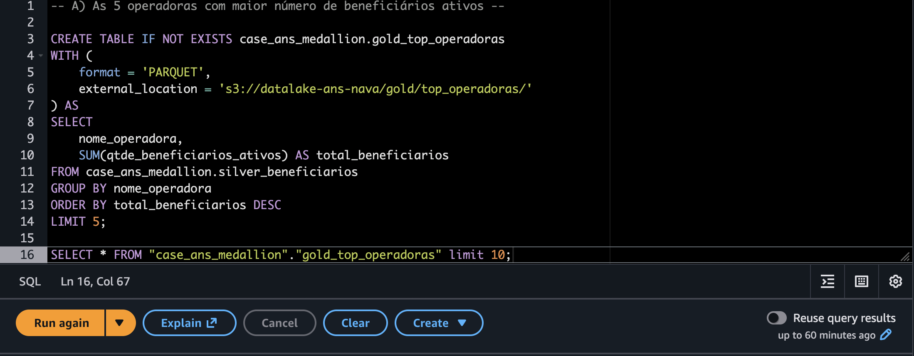
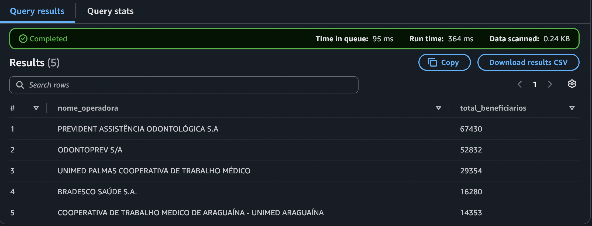
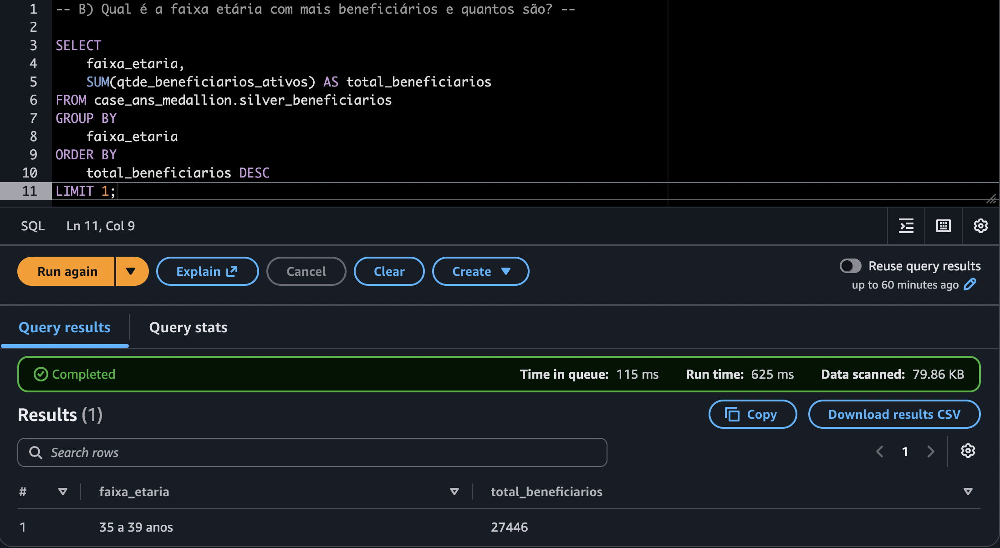
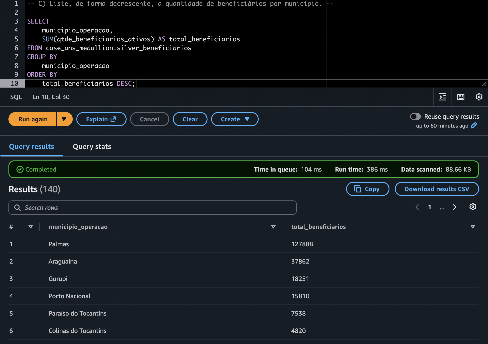

# Case ANS - Pipeline de Dados Medallion na AWS

## Visão Geral do Projeto

Este projeto implementa um pipeline de dados analítico na AWS utilizando a arquitetura **Medallion** (Bronze, Silver e Gold). O objetivo é realizar a ingestão, transformação e otimização de dados públicos da Agência Nacional de Saúde Suplementar (ANS), respondendo a perguntas das áreas de negócio.

## Arquitetura e Fluxo de Dados

O pipeline foi desenhado para ser serverless, utilizando o **Amazon S3** como Datalake e o **Amazon Athena** para processamento e transformação.

```mermaid
    A -->[Fonte: CSV ANS] -->|Ingestão| B(S3: Camada Bronze)
    B -->|Limpeza & Tipagem Athena| C(S3: Camada Silver)
    C -->|Agregação Athena| D(S3: Camada Gold)
```

- **Camada Bronze**: Armazena o dado cru em seu formato original (.csv), utilizando OpenCSVSerde para garantir a correta interpretação estrutural antes de qualquer transformação.

- **Camada Silver**: Os dados são limpos, tipados (CAST) e convertidos para o formato colunar Parquet. Colunas irrelevantes são descartadas para reduzir o scan nas próximas etapas.

- **Camada Gold**: Criação de tabelas agregadas e otimizadas, respondendo diretamente às métricas de negócio.

## Decisões de Engenharia e Boas Práticas

Durante o desenvolvimento, algumas decisões arquiteturais foram tomadas visando otimização e escalabilidade:

- Conversão para Parquet: A passagem de CSV (Bronze) para Parquet (Silver/Gold) garante alta taxa de compressão e leitura colunar. Isso reduz drasticamente a quantidade de dados escaneados pelo Athena, diminuindo custos e tempo de execução.

- Modularidade: A lógica de transformação não está hardcoded no script de orquestração. As queries foram isoladas em arquivos .sql na pasta sql/, facilitando a manutenção e a aplicação de linters de qualidade de código.

- Particionamento: Intencionalmente não aplicado. Dado que o arquivo fonte possui baixa volumetria (menos de 1MB), o particionamento geraria o Small Files Problem, degradando a performance do Athena ao forçá-lo a abrir múltiplos arquivos minúsculos no S3. O ganho de leitura ocorre inteiramente através do formato Parquet.

- Agregação: Aplicada na camada Gold para elevar o dado transacional (beneficiários) a indicadores sumarizados prontos para consumo por ferramentas de BI, funcionando como uma camada de caching físico no S3.

## Resultados e Indicadores (Camada Gold)

Abaixo estão os resultados das consultas processadas na camada Gold via AWS Athena, respondendo às exigências do case:

A) As 5 operadoras com maior número de beneficiários ativos




B) Qual é a faixa etária com mais beneficiários e quantos são.



C) Liste, de forma decrescente, a quantidade de beneficiários por município.



## Qualidade de Código e Testes Unitários

- Para garantir a resiliência do pipeline e evitar falhas silenciosas em produção, o projeto conta com testes unitários implementados com Pytest.
Os testes validam funções utilitárias críticas (como a leitura e o isolamento dos scripts SQL), garantindo que o código reaja corretamente a cenários ideais e de exceção (como arquivos ausentes). Essa suíte de testes é executada automaticamente na esteira de CI/CD (GitHub Actions) a cada novo commit.

Para executar os testes localmente:

```mermaid
poetry run pytest tests/ -v
```
